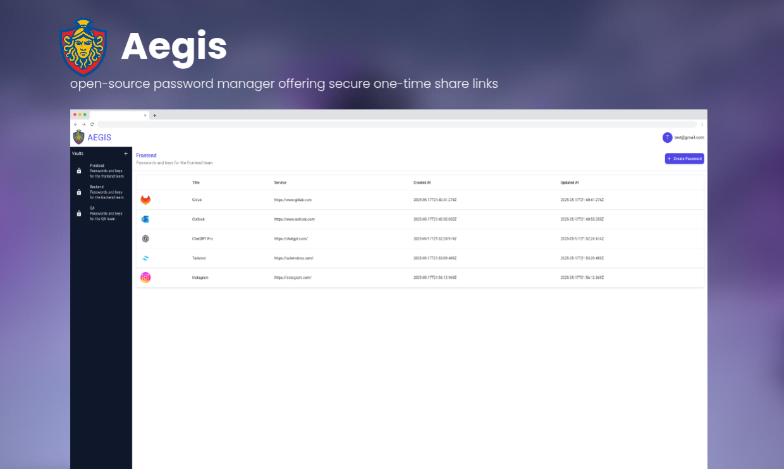

<h1 align="center">
  <br>
  <a href="http://www.amitmerchant.com/electron-markdownify"></a>
  <br>
  Aegis
  <br>
</h1>

<h4 align="center">Open source password manager for teams built on top of <a href="https://nextjs.org/" target="_blank">Next.js</a>.</h4>

<p align="center">
  <a href="#key-features">Key Features</a> •
  <a href="#how-to-use">How To Use</a> •
  <a href="#download">Download</a> •
  <a href="#credits">Credits</a> •
  <a href="#related">Related</a> •
  <a href="#license">License</a>
</p>



<h5 align="center">The project is still in the development phase.</h5>

## Key Features

* Password management
* Password generator
* One-time password sharing
* Share password other people or teams

## How To Use

To clone and run this application, you'll need [Git](https://git-scm.com) and [Node.js](https://nodejs.org/en/download/) (which comes with [npm](http://npmjs.com)) installed on your computer. From your command line:

```bash
# Clone this repository
$ git clone https://github.com/yessGlory17/aegis.git

# Go into the repository
$ cd aegis

# Install dependencies
$ npm install

# Run the app
$ npm run dev
```

## Emailware

Aegis is an password manager for teams. Meaning, if you liked using this app or it has helped you in any way, I'd like you send me an email at <ozgukurucan337@gmail.com> about anything you'd want to say about this software. I'd really appreciate it!

## Credits

This software uses the following open source packages:

- [React](https://react.dev/)
- [Nextjs](https://nextjs.org/)
- [MUI](https://mui.com/)
- [React Query](https://tanstack.com/query/latest)
- [Typescript](http://typescriptlang.org/)

